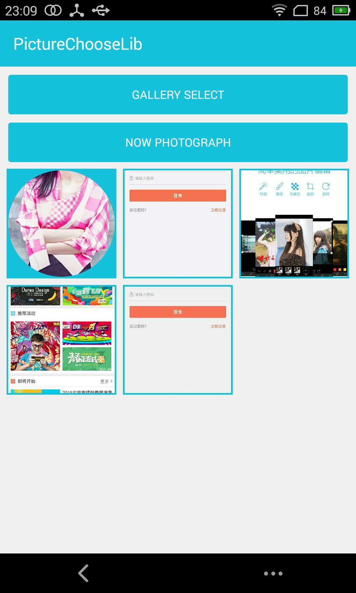

# PictureChooseLib
This is a picture select Android library that supports camera to take pictures, picture gallery multiple choice, image shearing！

For more information please see <a href='http://devsoulwolf.github.io/PictureChooseLib'>the website</a>

## Screenshots



## PictureChooseLib with Java code
```java
PictureProcess mPictureProcess = new PictureProcess(context);

// Gallery Select!
mPictureProcess.setPictureFrom(PictureFrom.GALLERY);
mPictureProcess.setClip(false);
mPictureProcess.setMaxPictureCount(5);
mPictureProcess.execute(OnPicturePickListener);

//Now Photograph
mPictureProcess.setPictureFrom(PictureFrom.CAMERA);
mPictureProcess.setClip(true);
mPictureProcess.setMaxPictureCount(1);
mPictureProcess.execute(OnPicturePickListener);

// Result
new OnPicturePickListener(){
    @Override
    public void onSuccess(List<String> pictures) {
            
   }

   @Override
   public void onError(Exception e) {

   }
};
```

## Maven
	<dependency>
  	    <groupId>net.soulwolf.image</groupId>
		<url>https://dl.bintray.com/soulwolf/maven</url>
  	    <artifactId>pictureChoose</artifactId>
  	    <version>1.0.0</version>
	</dependency>
## Gradle
	allprojects {
       repositories {
          jcenter()
       }
	}
	
	compile 'net.soulwolf.image:pictureChoose:1.0.0'

## Developed by
 Ching Soulwolf - <a href='javascript:'>Ching.Soulwolf@gmail.com</a>


## License
	Copyright 2015 Soulwolf Ching
	Copyright 2015 The Android Open Source Project for PictureChooseLib
	
	Licensed under the Apache License, Version 2.0 (the "License");
	you may not use this file except in compliance with the License.
	You may obtain a copy of the License at

	    http://www.apache.org/licenses/LICENSE-2.0
	
	Unless required by applicable law or agreed to in writing, software
	distributed under the License is distributed on an "AS IS" BASIS,
	WITHOUT WARRANTIES OR CONDITIONS OF ANY KIND, either express or implied.
	See the License for the specific language governing permissions and
	limitations under the License.
	